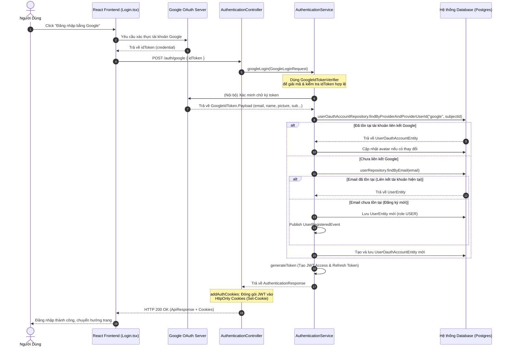

# Phân Tích Hệ Thống API Đăng Nhập Bằng Google (googleLogin / loginByGoogle)

Tài liệu này tổng hợp và phân tích chi tiết toàn bộ các lớp (classes), giao diện (interfaces), cơ sở dữ liệu (entities) và các thành phần frontend liên quan đến luồng xử lý API đăng nhập bằng Google.

---

## 1. Sơ đồ Luồng Hoạt Động (Sequence Diagram)

Dưới đây là mô hình tương tác giữa Client, Server và Google OAuth Provider khi thực hiện đăng nhập bằng Google:

---

## 2. Danh Sách Các Lớp (Classes) Tham Gia Ở Backend

Dưới đây là các lớp và thành phần ở phía Backend (`backend`) trực tiếp tham gia xử lý API này:

| Lớp/Giao diện (Class / Interface) | Loại / Package | Vai trò & Trách nhiệm |
| :--- | :--- | :--- |
| [SecurityConfig](file:///Users/ngocthanh/Documents/Material%20SU26/SWP391/swp391-su26-ai-audit-project-swp391_se20a11_group-02/backend/src/main/java/com/swp391/coding_platform/security/SecurityConfig.java) | Config | Cấu hình cho phép đường dẫn `/auth/google` được phép truy cập tự do (public/permitAll) không cần token bảo mật trước. |
| [AuthenticationController](file:///Users/ngocthanh/Documents/Material%20SU26/SWP391/swp391-su26-ai-audit-project-swp391_se20a11_group-02/backend/src/main/java/com/swp391/coding_platform/controller/auth/AuthenticationController.java) | Controller | Tiếp nhận HTTP Request `POST /auth/google`. Chuyển đổi dữ liệu JSON thành `GoogleLoginRequest`. Gọi Service xử lý và thiết lập HttpOnly Cookies từ kết quả JWT. |
| [GoogleLoginRequest](file:///Users/ngocthanh/Documents/Material%20SU26/SWP391/swp391-su26-ai-audit-project-swp391_se20a11_group-02/backend/src/main/java/com/swp391/coding_platform/dto/request/GoogleLoginRequest.java) | DTO (Request) | Chứa thuộc tính duy nhất `String idToken` gửi lên từ phía Client. |
| [AuthenticationService](file:///Users/ngocthanh/Documents/Material%20SU26/SWP391/swp391-su26-ai-audit-project-swp391_se20a11_group-02/backend/src/main/java/com/swp391/coding_platform/service/auth/AuthenticationService.java) | Service | **Chứa logic cốt lõi**. Xác thực token Google, tìm kiếm hoặc tạo tài khoản tương ứng, sinh JWT mới và trả về thông tin xác thực. |
| [UserOauthAccountEntity](file:///Users/ngocthanh/Documents/Material%20SU26/SWP391/swp391-su26-ai-audit-project-swp391_se20a11_group-02/backend/src/main/java/com/swp391/coding_platform/entity/user/UserOauthAccountEntity.java) | Entity | Thực thể lưu thông tin liên kết tài khoản mạng xã hội (với `provider = "google"` và `providerUserId = subjectId`). |
| [UserEntity](file:///Users/ngocthanh/Documents/Material%20SU26/SWP391/swp391-su26-ai-audit-project-swp391_se20a11_group-02/backend/src/main/java/com/swp391/coding_platform/entity/user/UserEntity.java) | Entity | Thực thể biểu diễn thông tin người dùng trong hệ thống (username, email, avatar, roles...). |
| [RoleEntity](file:///Users/ngocthanh/Documents/Material%20SU26/SWP391/swp391-su26-ai-audit-project-swp391_se20a11_group-02/backend/src/main/java/com/swp391/coding_platform/entity/auth/RoleEntity.java) | Entity | Thực thể lưu quyền hạn người dùng (gán mặc định là role `USER` cho tài khoản đăng ký mới). |
| [RoleName](file:///Users/ngocthanh/Documents/Material%20SU26/SWP391/swp391-su26-ai-audit-project-swp391_se20a11_group-02/backend/src/main/java/com/swp391/coding_platform/entity/enums/RoleName.java) | Enum | Enum chứa các quyền hạn hợp lệ của hệ thống (ví dụ `USER`). |
| [UserOauthAccountRepository](file:///Users/ngocthanh/Documents/Material%20SU26/SWP391/swp391-su26-ai-audit-project-swp391_se20a11_group-02/backend/src/main/java/com/swp391/coding_platform/repository/user/UserOauthAccountRepository.java) | Repository | Interface thao tác dữ liệu với bảng liên kết tài khoản OAuth (hỗ trợ `findByProviderAndProviderUserId`). |
| [UserRepository](file:///Users/ngocthanh/Documents/Material%20SU26/SWP391/swp391-su26-ai-audit-project-swp391_se20a11_group-02/backend/src/main/java/com/swp391/coding_platform/repository/user/UserRepository.java) | Repository | Interface thao tác dữ liệu người dùng (hỗ trợ `findByEmail`, `existsByUsername`, `save`). |
| [RoleRepository](file:///Users/ngocthanh/Documents/Material%20SU26/SWP391/swp391-su26-ai-audit-project-swp391_se20a11_group-02/backend/src/main/java/com/swp391/coding_platform/repository/auth/RoleRepository.java) | Repository | Interface truy vấn phân quyền người dùng. |
| [UserMapper](file:///Users/ngocthanh/Documents/Material%20SU26/SWP391/swp391-su26-ai-audit-project-swp391_se20a11_group-02/backend/src/main/java/com/swp391/coding_platform/mapper/UserMapper.java) | Mapper | Dùng để map đổi dữ liệu giữa `UserEntity` sang `AuthenticationResponse`. |
| [AuthenticationResponse](file:///Users/ngocthanh/Documents/Material%20SU26/SWP391/swp391-su26-ai-audit-project-swp391_se20a11_group-02/backend/src/main/java/com/swp391/coding_platform/dto/response/AuthenticationResponse.java) | DTO (Response) | Trả thông tin cơ bản của người dùng sau khi đăng nhập thành công. |
| [UserRegisteredEvent](file:///Users/ngocthanh/Documents/Material%20SU26/SWP391/swp391-su26-ai-audit-project-swp391_se20a11_group-02/backend/src/main/java/com/swp391/coding_platform/event/UserRegisteredEvent.java) | Event | Được kích hoạt khi có tài khoản mới đăng ký thành công qua Google. |
| [AppException](file:///Users/ngocthanh/Documents/Material%20SU26/SWP391/swp391-su26-ai-audit-project-swp391_se20a11_group-02/backend/src/main/java/com/swp391/coding_platform/exception/AppException.java) | Exception | Lớp ngoại lệ tuỳ chỉnh để ném ra mã lỗi `ErrorCode.UNAUTHENTICATED` nếu xác thực Google thất bại. |

---

## 3. Danh Sách Các Lớp/Thành Phần Tham Gia Ở Frontend

Các thành phần React (TypeScript) trực tiếp xử lý đăng nhập bằng Google:

| Thành phần/Tệp tin (Component / File) | Loại | Vai trò & Trách nhiệm |
| :--- | :--- | :--- |
| [App.tsx](file:///Users/ngocthanh/Documents/Material%20SU26/SWP391/swp391-su26-ai-audit-project-swp391_se20a11_group-02/frontend/src/App.tsx) | Component | Chứa thẻ bao `<GoogleOAuthProvider clientId={googleClientId}>` cung cấp môi trường chạy và tích hợp thư viện Google OAuth SDK cho các component con. |
| [Login.tsx](file:///Users/ngocthanh/Documents/Material%20SU26/SWP391/swp391-su26-ai-audit-project-swp391_se20a11_group-02/frontend/src/pages/Login.tsx) & [Register.tsx](file:///Users/ngocthanh/Documents/Material%20SU26/SWP391/swp391-su26-ai-audit-project-swp391_se20a11_group-02/frontend/src/pages/Register.tsx) | Page/Component | Sử dụng nút bấm `<GoogleLogin>` của thư viện `@react-oauth/google`. Nhận kết quả chứa token qua hàm callback `onSuccess` rồi gọi `googleLogin` từ `useApp()` Context. |
| [AppContext.tsx](file:///Users/ngocthanh/Documents/Material%20SU26/SWP391/swp391-su26-ai-audit-project-swp391_se20a11_group-02/frontend/src/context/AppContext.tsx) | Context Provider | Quản lý state đăng nhập toàn cục. Cung cấp hàm `googleLogin(idToken: string)` làm cầu nối trung gian gọi qua `authService`. |
| [authService.ts](file:///Users/ngocthanh/Documents/Material%20SU26/SWP391/swp391-su26-ai-audit-project-swp391_se20a11_group-02/frontend/src/services/authService.ts) | Service | Thực hiện gọi API HTTP POST tới `${BASE_URL}/auth/google` mang theo `idToken` trong payload dạng JSON và kèm option `credentials: 'include'` để lưu trữ JWT Token vào HTTP-Only Cookies ở trình duyệt. |

---

## 4. Các Thư Viện Bên Thứ Ba Hỗ Trợ Đăng Nhập Google

### Backend (`pom.xml`):
* `com.google.api-client:google-api-client`: Thư viện Client API chính thức của Google dùng để xác minh chữ ký mã hoá token (`GoogleIdTokenVerifier`) trực tiếp từ Google OAuth2 Identity Provider.

### Frontend (`package.json`):
* `@react-oauth/google`: Thư viện React Wrapper cho Google Identity Services SDK mới, cung cấp các nút đăng nhập chuẩn xác, tự động cấu hình và trả về Identity JWT (`idToken`).

---

## 5. Logic Chi Tiết Trong `AuthenticationService.googleLogin`

1. **Xác minh Token**:
   * Khởi tạo `GoogleIdTokenVerifier` với `NetHttpTransport` và `GsonFactory` của Google Client, thiết lập đối tượng đích (audience) là `GOOGLE_CLIENT_ID` cấu hình trong file `application-dev.yaml`.
   * Thực hiện verify `request.getIdToken()` để lấy thông tin giải mã payload.
2. **Trích xuất thông tin Google Profile**:
   * Lấy `subjectId` (mã định danh duy nhất của user trên Google).
   * Lấy `email`, `name` (tên hiển thị), `pictureUrl` (ảnh đại diện).
3. **Tìm kiếm & Tạo liên kết tài khoản**:
   * Gọi `userOauthAccountRepository.findByProviderAndProviderUserId("google", subjectId)`.
   * **Nếu đã tồn tại**:
     * Lấy `UserEntity` tương ứng. Cập nhật `avatarUrl` nếu người dùng đổi ảnh đại diện trên Google.
   * **Nếu chưa tồn tại**:
     * Kiểm tra xem đã có tài khoản hệ thống nào đăng ký trùng với `email` của Google chưa bằng `userRepository.findByEmail(email)`.
     * Nếu trùng `email`: Sử dụng luôn `UserEntity` này.
     * Nếu chưa trùng:
       * Tự tạo một `username` duy nhất dựa theo cấu trúc `<email_prefix>_<random_suffix>`.
       * Tạo thực thể `UserEntity` mới với các thông tin cá nhân từ Google và gán mặc định phân quyền `RoleName.USER`.
       * Bắn ra sự kiện `UserRegisteredEvent` qua Spring Event Publisher.
     * Tạo liên kết OAuth tài khoản mạng xã hội mới thông qua `UserOauthAccountEntity` liên kết với `UserEntity`.
4. **Cấp phát JWT và cookie**:
   * Gọi hàm `generateToken(userEntity, isRefreshToken)` để sinh ra Access Token và Refresh Token JWT mới dựa trên thông tin người dùng.
   * Trả về `AuthenticationResponse` để `AuthenticationController` đưa hai token này vào HTTP-Only Cookie rồi trả về cho trình duyệt Client.
